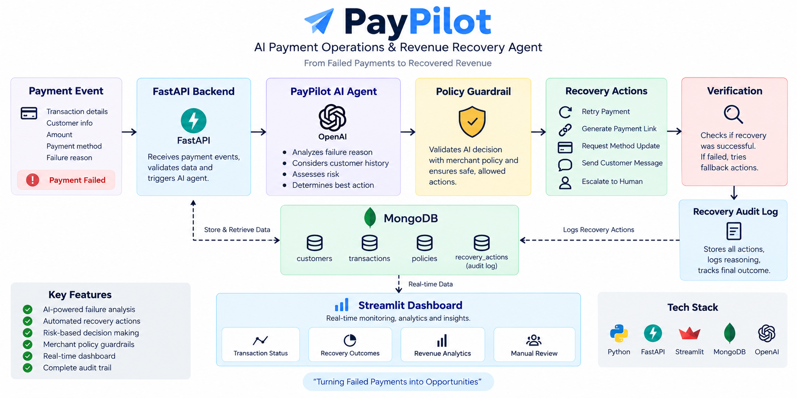

# 💳 PayPilot

### AI Payment Operations & Revenue Recovery Agent

PayPilot is an AI-powered payment operations agent that helps merchants
identify failed payments, understand why they failed, and automatically
take the safest recovery action.

Instead of simply reporting a failed transaction, PayPilot analyzes the
transaction, customer history, and merchant policy before executing a
bounded recovery action.

---

## 🎯 Problem

Failed payments directly affect merchant revenue.

Traditional payment systems usually report:

> Payment Failed

But the merchant still needs to decide:

- Why did the payment fail?
- Should it be retried?
- Should the customer use another payment method?
- Is the transaction suspicious?
- Should a human review it?

PayPilot automates this decision-making process.

---

## 💡 Solution

PayPilot follows an agentic workflow:

```text
Payment Event
      ↓
    FastAPI
      ↓
   MongoDB
      ↓
Transaction + Customer History + Merchant Policy
      ↓
     AI Analysis
      ↓
  Policy Guardrail
      ↓
 Recovery Decision
      ↓
 Execute Action
      ↓
 Verify Result
      ↓
 Recovery Audit Log
 
 
 ## 🏗️ Architecture

